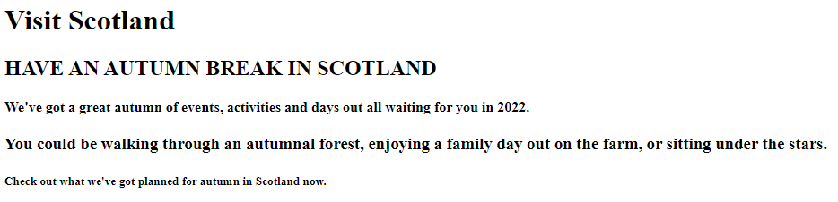

# Task 3a - Visit Scotland - Main Page (Predict & Run)
# Instructions

Look at the image below:

---

---

Edit the markdown file ```predict.md``` and complete the tags you think are needed for each piece of text.

Remember to click on the ```submit project``` button in the top right of the Replit window when you have finished.

# Original Code (in case you need it) 

```
<!DOCTYPE html>
<html>

<head>
  <title>Task 3a</title>
  <link href="style.css" rel="stylesheet" type="text/css" />
</head>

<body>
  Visit Scotland
    
  HAVE AN AUTUMN BREAK IN SCOTLAND
    
  We've got a great autumn of events, activities and days out all waiting for you in 2022.
  
  You could be walking through an autumnal forest, enjoying a family day out on the farm, or sitting under the stars.
  
  Check out what we've got planned for autumn in Scotland now.
</body>

</html>

```
