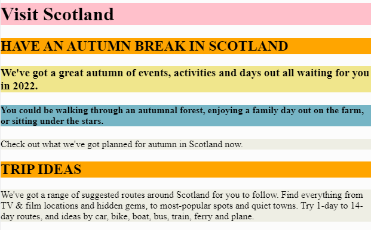

# Task 3b - Visit Scotland - Main Page (Investigate & Modify)
# Instructions

Look at the image below:

---

---

Edit the HTML file ```index.html``` and select from the tags listed below to help you make your webpage match the above image.

Modification A - choose between tag `<h1>` and `<p>`

Modification B - choose between tag `<h3>` and `<h4>`

Modification C - choose between tag `<h2>` and `<h4>`

Remember to click on the ```submit project``` button in the top right of the Replit window when you have finished.

# Original Code (in case you need it) 

```
<!DOCTYPE html>
<html>

<head>
  <title>Task 3b</title>
  <link href="style.css" rel="stylesheet" type="text/css" />
</head>

<body>
  Visit Scotland
    
  HAVE AN AUTUMN BREAK IN SCOTLAND
    
  We've got a great autumn of events, activities and days out all waiting for you in 2022.
  
  You could be walking through an autumnal forest, enjoying a family day out on the farm, or sitting under the stars.
  
  Check out what we've got planned for autumn in Scotland now.
</body>

</html>

```
