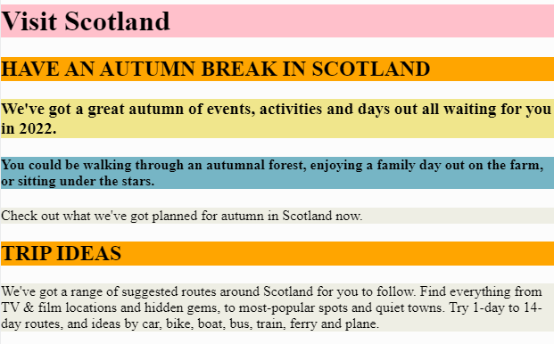
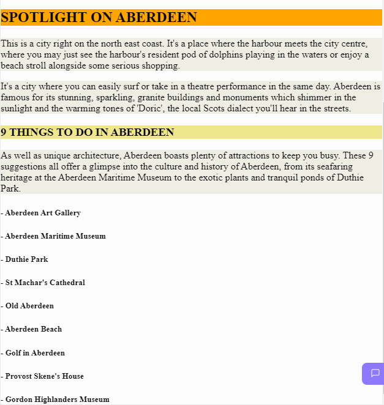

# Task 3c - Visit Scotland - Extending the Main Page
# Instructions

You should now be familiar with the following tags:

- `<html>`, `<head>`, `<body>` and `<title>`
- The heading tags `<h1>` to `<h6>`
- The paragraph tag `<p>`

Initialy the webpage for this project should look like this:

---

---

There is a file called ```aberdeen.txt``` in this project. **Add** the contents of this file to the ```index.html``` file and use appropriate heading and paragraph tags to make the new content look like the image below (the rest of the page is displayed above this):

---

---

Remember to click on the ```submit project``` button in the top right of the Replit window when you have finished.

# Original Code (in case you need it) 

```
<!DOCTYPE html>
<html>

<head>
  <title>Task 3c</title>
  <link href="style.css" rel="stylesheet" type="text/css" />
</head>

<body>
  <h1>Visit Scotland</h1>
    
  <h2>HAVE AN AUTUMN BREAK IN SCOTLAND</h2>

  
  <h3>We've got a great autumn of events, activities and days out all waiting for you in 2022.</h3>
  
  <h4>You could be walking through an autumnal forest, enjoying a family day out on the farm, or sitting under the stars.</h4>
  
  <p>Check out what we've got planned for autumn in Scotland now.</p>

  
  <h2>TRIP IDEAS</h2>
<p>We've got a range of suggested routes around Scotland for you to follow. Find everything from TV & film locations and hidden gems, to most-popular spots and quiet towns. Try 1-day to 14-day routes, and ideas by car, bike, boat, bus, train, ferry and plane.</p>
  
</body>

</html>

```
