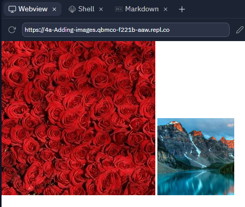

# 4. Add the blue image

To display the blue image on the screen **with width 150 pixels** you should use one of the three lines of code:

```html:

```

```html:

```

```html:

```

Select one of the three lines of code shown above and add this to the line directly underneath the following comment:

```html:
<!-- Add the blue image here -->
```

If you have done this correctly you should see the following web page:

