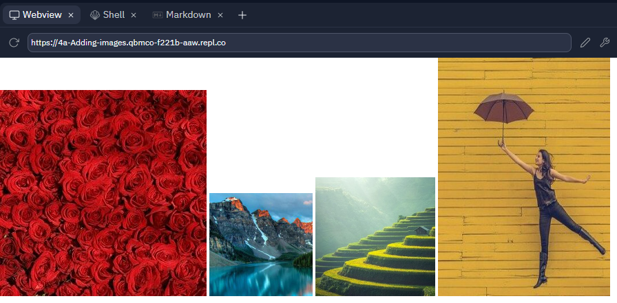

# 6. Add the yellow image

To display the yellow image on the screen **with width 250 pixels and height 50 percent of the original size** you should be able to use the `````` tag appropriately.

Add this to the line directly underneath the following comment:

```html:
<!-- Add the yellow image here -->
```

If you have done this correctly you should see the following web page:

